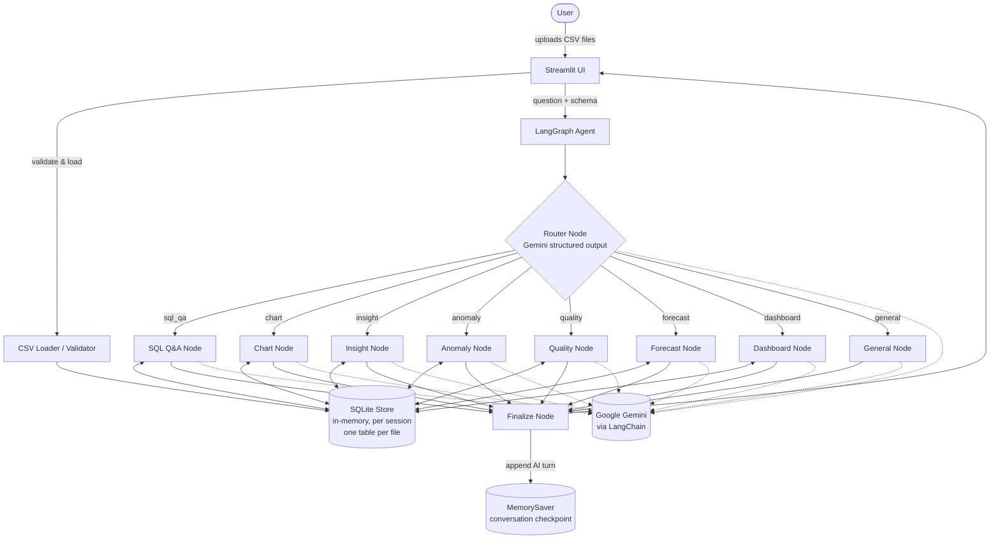
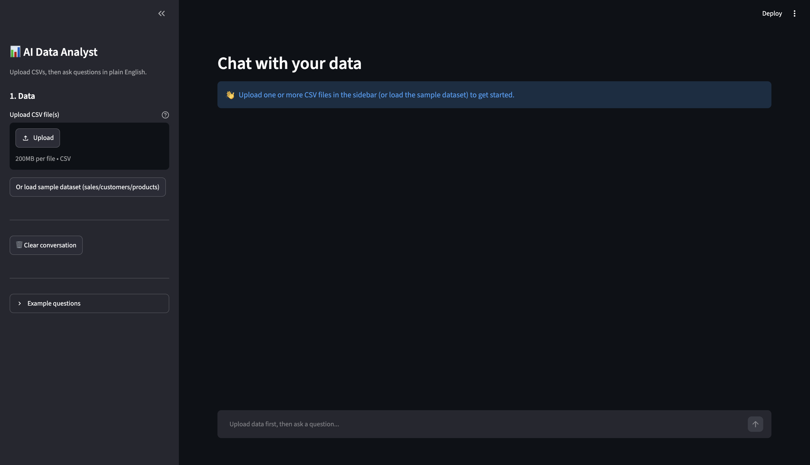
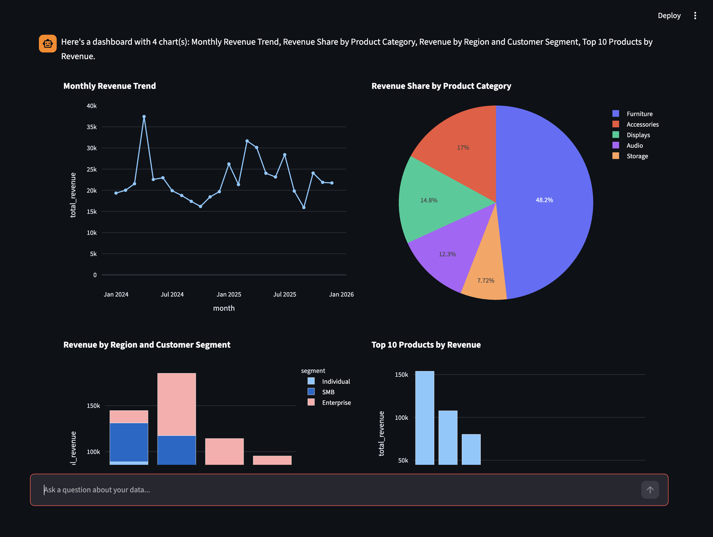

# AI-Powered Data Analyst

Upload one or more CSV files and analyze them in plain English: ask
questions, get charts, business insights, anomaly detection, data
quality checks, and simple forecasts — with the reasoning behind every
answer.

Built with **Streamlit**, **LangGraph**, **LangChain**, and **Google
Gemini**.

---

## Features

**Core**
- Upload and validate one or more CSV files (empty files, duplicate
  headers, zero-row files, oversized uploads all caught with clear
  errors)
- Natural-language Q&A, answered via real generated SQL executed
  against an in-memory SQLite database
- Business insight summaries (top/bottom performers, trends,
  concentration)
- Charts: bar, line, pie, scatter (Plotly, interactive)
- Generated SQL is always shown alongside the answer
- Anomaly detection (statistical z-score/IQR, group-aware) with
  plain-language explanations of *why* each record was flagged
- Every answer includes the reasoning behind it, not just the result
- Conversation memory across a session (follow-ups like *"now break
  that down by product"* resolve correctly)

**Bonus features implemented**
- **Multi-file analysis** — every upload becomes its own SQLite table;
  the agent can write real `JOIN`s across files that share key columns
- **Dashboard generation** — one request builds a small multi-chart
  overview of the dataset
- **Data quality checks** — missing values, duplicate rows, unparseable
  dates, unexpected negatives, constant columns, with a heuristic
  0–100 quality score
- **Forecasting** — lightweight linear-trend + seasonal-naive baseline
  with an uncertainty band (see [Assumptions](#assumptions--implementation-notes))
- **Docker support**
- **Logging/observability** — structured logs to stdout + rotating file
  ([`src/logging_config.py`](src/logging_config.py))

---

## Architecture

The agent is an **explicit multi-node LangGraph graph**, not a single
tool-calling loop: a router node classifies intent, then hands off to
one specialized node per capability. Every data-touching node follows
the same pattern — ask Gemini for a structured plan → execute it with
deterministic Python → self-correct once on failure → ask Gemini to
explain the result in plain language. The LLM never touches raw data
directly; it only ever sees what the deterministic tools return.



**Why a multi-node graph instead of one tool-calling agent:** routing
is an explicit, inspectable step (you can log/debug exactly why a
question was classified as `chart` vs `insight`), each node's prompt
is narrowly scoped to its task (better SQL/chart-spec quality than one
do-everything system prompt), and it's straightforward to add a new
capability as a new node without touching the others.

**Why SQLite instead of pure pandas:** the assignment calls for real
generated SQL, and running that SQL for real (rather than just
displaying it as text) means the app can actually execute `JOIN`s
across multiple uploaded files, which is what makes multi-file
analysis genuinely work rather than being decorative.

### Project structure

```
app.py                      # Streamlit entry point
src/
  config.py                 # env-based settings
  logging_config.py         # structured logging (stdout + rotating file)
  data/
    loader.py                # CSV validation & normalization
    sql_store.py              # in-memory SQLite store + schema introspection
  tools/                     # deterministic, LLM-free, unit-testable
    sql_tool.py                # read-only SQL execution guard
    chart_tool.py               # Plotly chart building + type heuristic
    anomaly_tool.py              # z-score / IQR outlier detection
    quality_tool.py               # missing/dupe/dtype/date checks + score
    forecast_tool.py               # linear-trend + seasonal-naive forecast
  llm/
    gemini.py                  # ChatGoogleGenerativeAI client (LangChain)
    schemas.py                  # Pydantic structured-output schemas
  graph/
    state.py                    # LangGraph AgentState
    router.py                    # intent classification node
    nodes.py                      # one node per capability
    build_graph.py                 # wires router -> nodes -> finalize
tests/                       # pytest, mirrors src/ (see Testing below)
sample_data/                 # synthetic sales/customers/products CSVs
scripts/generate_sample_data.py  # regenerates sample_data/
```

---

## Setup

### Option A: Docker (preferred)

```bash
cp .env.example .env
# edit .env and set GOOGLE_API_KEY

docker compose up --build
```

Open http://localhost:8501.

### Option B: Local Python

Requires Python 3.11+.

```bash
python -m venv venv
source venv/bin/activate        # Windows: venv\Scripts\activate

pip install -r requirements.txt

cp .env.example .env
# edit .env and set GOOGLE_API_KEY

streamlit run app.py
```

Get a free Gemini API key at https://aistudio.google.com/apikey.

### Try it fast

Once the app is running, click **"Or load sample dataset"** in the
sidebar instead of uploading your own files — it loads
`sample_data/sales.csv`, `customers.csv`, and `products.csv`
(synthetic, ~1,800 orders across 4 regions, 2 years, with built-in
anomalies and data-quality issues to find). Then try the example
questions listed in the sidebar.

---

## Testing

```bash
pip install -r requirements-dev.txt
pytest -v
```

`tests/` covers every deterministic tool (`sql_tool`, `quality_tool`,
`anomaly_tool`, `forecast_tool`, `chart_tool`, `loader`) with no Gemini
API calls required, so these run offline/in CI without a key. The
graph/LLM layer (routing, SQL generation, prompts) is not
unit-tested — it needs a live Gemini key to exercise meaningfully, and
mocking structured LLM output would mostly test the mocks. Manual
end-to-end testing against the sample dataset is the intended way to
validate that layer; see the demo video/screenshots below.

---

## Assumptions & implementation notes

- **Forecasting is a lightweight baseline** (numpy linear-trend +
  seasonal-naive), not ARIMA/Prophet/statsmodels — chosen to keep the
  dependency footprint small for a demo app. `src/tools/forecast_tool.py`
  is a self-contained module; swapping in a heavier model means
  changing only that file.
- **SQL execution is read-only by design.** `INSERT/UPDATE/DELETE/
  DROP/ALTER/CREATE/ATTACH/PRAGMA/...` are all rejected before
  execution ([`src/tools/sql_tool.py`](src/tools/sql_tool.py)) — this
  is an analyst tool, so the LLM's generated SQL is never trusted with
  write access.
- **One SQLite table per uploaded file**, named from a sanitized
  version of the filename. The agent is told each table's schema and
  a few sample rows, so it can `JOIN` across files that share key
  columns (e.g. `sales.customer_id = customers.customer_id`) — see the
  sample dataset for a working example.
- **Anomaly detection is statistics-first, LLM-second.** Outliers are
  found with real z-score/IQR math (optionally within groups, e.g. per
  region); the LLM's only job is explaining flagged records in plain
  language, never deciding what counts as anomalous.
- **LLM response content is normalized before display.** Some model
  responses come back as a plain string; others come back as a list of
  content blocks (e.g. `[{"type": "text", "text": "...", "extras": {...}}]`,
  seen with thinking-capable models/newer LangChain versions). Every
  answer is passed through `extract_text()` in
  [`src/llm/gemini.py`](src/llm/gemini.py) before it reaches the UI, so
  the app never renders a raw Python list where it should render text.
- **The Gemini API key is read from `.env`** (`GOOGLE_API_KEY`), per
  the intended deployment model for this assignment — a developer
  configures it once for the deployed instance rather than each user
  supplying their own key in the UI.
- **Row/upload limits** (`MAX_SQL_ROWS=500`, `MAX_UPLOAD_MB=50` in
  `.env.example`) exist to keep prompts small and the UI responsive on
  large files; both are configurable.
- **Conversation memory** uses LangGraph's `MemorySaver` checkpointer
  keyed by a per-session id, so it resets when the app restarts or the
  session ends. This is a single-instance in-memory implementation
  intended for the scope of this assignment — a persistent checkpointer
  (e.g. backed by SQLite/Postgres) would be a straightforward swap in
  `src/graph/build_graph.py` for durability across restarts.
- **This was built and unit-tested in a sandboxed environment without
  network access**, so `pytest`/the tool layer was verified directly,
  but the Streamlit UI and the LangGraph/Gemini agent layer could not
  be executed end-to-end before delivery. The code was written
  carefully against current LangChain/LangGraph/Streamlit APIs and
  reviewed line-by-line, but please treat first-run debugging (e.g. a
  renamed Gemini model id, a minor LangGraph API signature change) as
  expected, not a sign something is fundamentally wrong. If
  `with_structured_output` errors on your installed LangChain version,
  pin closer to the versions in `requirements.txt`.

---

## Screenshots & demo video

_Add screenshots and a short demo video/GIF here after running the app
locally (see Setup above) — they could not be captured in the
environment this was built in._

<!--


-->

**Live app link:** _add here if deployed._

---

## Possible next steps

- Persistent checkpointer for conversation memory across restarts
- Streaming token-by-token responses in the UI
- Swap the forecast baseline for statsmodels/Prophet
- Export a report (PDF/HTML) of a session's Q&A + charts
- An eval set of the example questions with expected SQL/answers, run
  in CI against a live Gemini key
